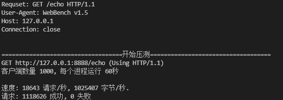
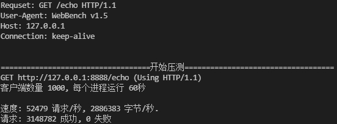

# a high concurrency WebServer in linux


该项目是在Linux环境下，使用C++11标准编写的一个遵循 One Loop Per Thread 思想的高性能 Web 服务器，支持一定数量的客户端连接并发连接并及时响应，支持客户端对服务器静态资源的访问，在特定端口浏览、上传和下载服务器文件。


## 技术要点

- 实现了基于双缓冲技术的多线程异步日志系统，分离日志写入与业务处理，提高日志系统的写入效率。
- 使用主从 Reactor 网络模式，和基于 Epoll 的 I/O 多路复用技术（ET边缘触发工作模式），提高服务器的并发处理能力。
- 使用有限状态机解析 HTTP 请求，支持GET、POST、HEAD请求方法，支持HTTP长连接与短连接。
- 使用小根堆做定时器，惰性删除超时的任务，即客户端没有向服务器发送请求的时间已经超过给定的超时时间，当再次访问它的时候才会去关闭这个连接。
- 实现了LFU缓存淘汰策略，实现高频页面的高效传输，提高服务器响应。
- 模仿STL allocator，实现了基于哈希桶的内存池，提高程序内存的利用效率。
- 使用了智能指针、bind、function、右值引用、范围循环等一些 c++11 的新特性


## 整体框架




## 项目构建

项目的基本文件结构如下：

```text
./webserver
├── img
│   ├── 主从Reactor模式.svg
│   └── 多线程异步日志库系统.svg
├── README.md
└── WebServer
    ├── build.sh
    ├── CMakeLists.txt
    ├── README.md
    └── src
        ├── base
        ├── client
        ├── CMakeLists.txt
        ├── connection
        ├── FTPClient
        ├── LFUCache
        ├── Main.cc
        ├── manager
        ├── memory
        ├── package
        ├── page
        ├── reactor
        ├── server
        └── threadPool
```


### 环境

- 硬件平台：阿里云 轻量应用服务器 （双核4G，6M 带宽）
- OS version：Ubuntu 18.04
- Complier version: g++ 7.4.0 (Ubuntu 7.4.0-1ubuntu1~18.04)
- cmake version: 3.10.2
- Debugger version: gdb (Ubuntu 8.1.1-0ubuntu1) 8.1.1


### 构建

```shell
# 切换到主目录
cd ./WerServer/
# 使用脚本构建项目
sh ./build.sh
```


### 运行

```shell
    # 直接输入参数启动
    ./web_server [-p port] [-t thread_numbers] [-f log_file_name] [-o open_log] [-s log_to_stderr] [-c color_log_to_stderr] [-l min_log_level]
    # 使用脚本启动
    sh ./run_server.sh
```

- `port`：为服务器监听的端口号，默认为 8888
- `thread_numbers` ：为 `subReactor` 的数目，也就是业务线程池中的线程数（不包括后台的日志线程），默认为2
- `log_file_name` : 为服务器日志文件的路径，默认为 `WebServer` 所在的目录，文件不存在的话程序会自动创建
- `open_log` : 是否启用日志功能，1-启用 0-不启用
- `log_to_stderr`：日志同时输出到 `stderr`，1-启用 0-不启用
- `color_log_to_stderr`：输出日志颜色，1-启用 0-不启用
- `min_log_level`：输出的最小日志等级，0-DEBUG 1-INFO 2-WARNING 3-ERROR 4-FATAL


## 压力测试

压力测试使用开源压测工具 WebBench，开启1000个进程，访问服务器60s，过程是客户端发出请求，然后服务器读取并解析，返回响应报文，客户端读取。

长连接因为不需要频繁的创建新套接字去响应请求，然后发送数据读取数据，关闭套接字等操作，所以比短连接QPS高很多。

### 参数调节

- 将单个进程可以打开的文件描述符 descriptors 设置成了 10w
- 程序中关闭了套接字的TCP Nagle算法, 避免响应时间过久，每次数据直接发，而不用等到一定量再一起发。


### 压测结果

本地测试：

- HTTP短连接(QPS:1.8w)



- HTTP长连接(QPS:5.2万)

